Predicting Breast Cancer Mortality from Clinical and Genomic Data
(METABRIC)
================
Saba Naji

- [Part 1. Data Exploration and Feature
  Selection](#part-1-data-exploration-and-feature-selection)
  - [1.1 Loading the data](#11-loading-the-data)
  - [1.2 Mutation columns as binary
    indicators](#12-mutation-columns-as-binary-indicators)
  - [1.3 Defining the target](#13-defining-the-target)
  - [1.4 Removing identifiers and leakage
    variables](#14-removing-identifiers-and-leakage-variables)
  - [1.5 Numeric variables that are really
    categorical](#15-numeric-variables-that-are-really-categorical)
  - [1.6 Missing values](#16-missing-values)
  - [1.7 Exploratory plots](#17-exploratory-plots)
  - [1.8 Train / test split](#18-train--test-split)
  - [1.9 Imputation (training statistics
    only)](#19-imputation-training-statistics-only)
  - [1.10 Removing uninformative and redundant
    features](#110-removing-uninformative-and-redundant-features)
  - [1.11 Scaling (training statistics
    only)](#111-scaling-training-statistics-only)
  - [1.12 PCA](#112-pca)
  - [1.13 Summary of the
    preprocessing](#113-summary-of-the-preprocessing)
- [Part 2. Baseline Models: Lasso and Ridge Logistic
  Regression](#part-2-baseline-models-lasso-and-ridge-logistic-regression)
  - [2.1 Feature subsets](#21-feature-subsets)
  - [2.2 Cross-validation set-up and helper
    functions](#22-cross-validation-set-up-and-helper-functions)
  - [2.3 Lasso and Ridge on the three
    subsets](#23-lasso-and-ridge-on-the-three-subsets)
  - [2.4 Features selected by Lasso (combined
    subset)](#24-features-selected-by-lasso-combined-subset)
- [Part 3. Ensemble and Non-linear
  Models](#part-3-ensemble-and-non-linear-models)
  - [3.1 Hyper-parameter grids](#31-hyper-parameter-grids)
  - [3.2 KNN and SVM](#32-knn-and-svm)
  - [3.3 Decision tree and random forest (depth tuned by
    CV)](#33-decision-tree-and-random-forest-depth-tuned-by-cv)
  - [3.4 AdaBoost](#34-adaboost)
  - [3.5 Results](#35-results)
- [Part 4. Model Comparison and Interpretation with
  SHAP](#part-4-model-comparison-and-interpretation-with-shap)
  - [4.1 Overall comparison](#41-overall-comparison)
  - [4.2 SHAP values for the best
    model](#42-shap-values-for-the-best-model)
  - [4.3 Global feature importance](#43-global-feature-importance)
  - [4.4 Dependence plot for the most important
    feature](#44-dependence-plot-for-the-most-important-feature)
  - [4.5 Top 10 contributing features](#45-top-10-contributing-features)
- [Conclusion](#conclusion)

``` r
# Data handling and plots
library(readr)
library(dplyr)
library(tidyr)
library(ggplot2)

# Modelling
library(caret)      # training / cross-validation framework
library(glmnet)     # Lasso and Ridge logistic regression
library(pROC)       # ROC curves and AUC
library(kernlab)    # SVM with RBF kernel (used by caret "svmRadial")
library(rpart)      # decision trees
library(ranger)     # random forest
library(gbm)        # boosting with the AdaBoost (exponential) loss
library(doParallel) # parallel cross-validation

set.seed(123)
```

# Part 1. Data Exploration and Feature Selection

## 1.1 Loading the data

``` r
data_path <- file.path("..", "data", "METABRIC_RNA_Mutation.csv")

# guess_max is large so that mutation columns (mostly "0" in the first rows,
# protein-change labels such as "H1047R" later) are read as text, not numbers
df_raw <- read_csv(data_path, guess_max = 5000, show_col_types = FALSE)

# Three column names contain "-" or "+" or start with a digit, which breaks
# R formulas and some models (rpart). They are renamed to syntactic names.
df_raw <- df_raw |>
  rename(
    pam50_claudin_low_subtype     = `pam50_+_claudin-low_subtype`,
    three_gene_classifier_subtype = `3-gene_classifier_subtype`,
    hla_g                         = `hla-g`
  )

dim(df_raw)
```

    ## [1] 1904  693

The dataset has 1904 patients and 693 columns. The columns fall into
three groups:

- **clinical** variables (columns 1–31): age, tumour size, grade,
  receptor status, treatments, survival outcome, …
- **gene expression** (mRNA z-scores) for 489 genes (columns 32–520),
- **mutation** columns for 173 genes (names ending in `_mut`). Each cell
  holds `0` when the gene is not mutated, or the protein change (for
  example `H1047R`) when it is.

``` r
# Keep the original column groups so that we can build feature subsets later
clinical_cols   <- names(df_raw)[1:31]
mutation_cols   <- grep("_mut$", names(df_raw), value = TRUE)
expression_cols <- setdiff(names(df_raw)[32:ncol(df_raw)], mutation_cols)

c(clinical = length(clinical_cols),
  expression = length(expression_cols),
  mutation = length(mutation_cols))
```

    ##   clinical expression   mutation 
    ##         31        489        173

## 1.2 Mutation columns as binary indicators

In the raw file a mutation column can have hundreds of different values
(one per protein change). Treating them as factors would create
thousands of dummy variables, most of them seen in only one patient. For
prediction the useful information is whether the gene is mutated or not,
so each mutation column is recoded to 0/1.

``` r
n_levels_before <- sapply(df_raw[mutation_cols], n_distinct)
summary(n_levels_before)
```

    ##    Min. 1st Qu.  Median    Mean 3rd Qu.    Max. 
    ##    2.00   13.00   27.00   45.84   52.00  343.00

``` r
df_raw <- df_raw |>
  mutate(across(all_of(mutation_cols), ~ as.integer(.x != "0")))

# Number of patients with a mutation in the five most frequently mutated genes
sort(colSums(df_raw[mutation_cols]), decreasing = TRUE)[1:5]
```

    ## pik3ca_mut   tp53_mut  muc16_mut ahnak2_mut  kmt2c_mut 
    ##        795        659        326        311        234

## 1.3 Defining the target

``` r
table(df_raw$death_from_cancer, useNA = "ifany")
```

    ## 
    ##      Died of Disease Died of Other Causes               Living 
    ##                  622                  480                  801 
    ##                 <NA> 
    ##                    1

``` r
df <- df_raw |>
  filter(death_from_cancer %in% c("Living", "Died of Disease")) |>
  mutate(
    death_from_cancer = factor(
      if_else(death_from_cancer == "Died of Disease", "Died", "Living"),
      levels = c("Died", "Living")
    )
  )

table(df$death_from_cancer)
```

    ## 
    ##   Died Living 
    ##    622    801

Only patients who are **Living** or **Died of Disease** are kept.
Patients who died of other causes (480) and one patient with a missing
outcome are removed, so the target represents breast-cancer–specific
death only. This leaves 1423 patients (622 Died, 801 Living). The
positive class for all metrics is **Died**.

## 1.4 Removing identifiers and leakage variables

``` r
# overall_survival is identical to the target after the filter above
table(df$overall_survival, df$death_from_cancer)
```

    ##    
    ##     Died Living
    ##   0  622      0
    ##   1    0    801

``` r
leakage_cols <- c("patient_id", "overall_survival", "overall_survival_months")
df <- df |> select(-all_of(leakage_cols))
```

Three columns must not be used as predictors:

- `patient_id` is only an identifier.
- `overall_survival` is exactly the same as the target once the other
  causes of death are removed (see the table above).
- `overall_survival_months` is the follow-up time. It is measured at the
  end of the study, not at diagnosis, and patients who died of cancer
  have much shorter follow-up by definition. Using it would leak the
  outcome into the model.

## 1.5 Numeric variables that are really categorical

``` r
num_cols <- names(df)[sapply(df, is.numeric)]
num_cols <- setdiff(num_cols, mutation_cols)

# Numeric columns with 10 or fewer distinct values
cat_like_numeric <- num_cols[sapply(df[num_cols], function(x) n_distinct(x, na.rm = TRUE) <= 10)]
cat_like_numeric
```

    ## [1] "chemotherapy"              "cohort"                   
    ## [3] "neoplasm_histologic_grade" "hormone_therapy"          
    ## [5] "radio_therapy"             "tumor_stage"

``` r
df <- df |>
  mutate(across(all_of(cat_like_numeric), as.factor)) |>
  mutate(across(where(is.character), as.factor))
```

Treatment indicators (`chemotherapy`, `hormone_therapy`,
`radio_therapy`), `cohort` and `neoplasm_histologic_grade` are stored as
numbers but describe groups, so they are converted to factors. All
remaining text columns are converted to factors as well. Mutation
indicators stay as 0/1 numbers.

``` r
summary(df[, intersect(clinical_cols, names(df))])
```

    ##  age_at_diagnosis       type_of_breast_surgery         cancer_type  
    ##  Min.   :21.93    BREAST CONSERVING:601        Breast Cancer :1422  
    ##  1st Qu.:49.10    MASTECTOMY       :806        Breast Sarcoma:   1  
    ##  Median :58.39    NA's             : 16                             
    ##  Mean   :58.21                                                      
    ##  3rd Qu.:67.58                                                      
    ##  Max.   :96.29                                                      
    ##                                                                     
    ##                                 cancer_type_detailed   cellularity 
    ##  Breast                                   :  15      High    :706  
    ##  Breast Invasive Ductal Carcinoma         :1136      Low     :150  
    ##  Breast Invasive Lobular Carcinoma        : 104      Moderate:525  
    ##  Breast Invasive Mixed Mucinous Carcinoma :  17      NA's    : 42  
    ##  Breast Mixed Ductal and Lobular Carcinoma: 141                    
    ##  NA's                                     :  10                    
    ##                                                                    
    ##  chemotherapy pam50_claudin_low_subtype cohort  er_status_measured_by_ihc
    ##  0:1050       Basal      :169           1:406   Negative: 369            
    ##  1: 373       Her2       :172           2:234   Positve :1034            
    ##               LumA       :461           3:505   NA's    :  20            
    ##               LumB       :339           4:177                            
    ##               NC         :  4           5:101                            
    ##               Normal     :112                                            
    ##               claudin-low:166                                            
    ##     er_status    neoplasm_histologic_grade her2_status_measured_by_snp6
    ##  Negative: 381   1   :115                  GAIN   : 333                
    ##  Positive:1042   2   :536                  LOSS   :  81                
    ##                  3   :734                  NEUTRAL:1006                
    ##                  NA's: 38                  UNDEF  :   3                
    ##                                                                        
    ##                                                                        
    ##                                                                        
    ##    her2_status   tumor_other_histologic_subtype hormone_therapy
    ##  Negative:1218   Ductal/NST:1100                0:568          
    ##  Positive: 205   Mixed     : 141                1:855          
    ##                  Lobular   : 104                               
    ##                  Medullary :  20                               
    ##                  Mucinous  :  17                               
    ##                  (Other)   :  31                               
    ##                  NA's      :  10                               
    ##  inferred_menopausal_state integrative_cluster primary_tumor_laterality
    ##  Post:1033                 8      :195         Left :693               
    ##  Pre : 390                 10     :188         Right:650               
    ##                            3      :184         NA's : 80               
    ##                            4ER+   :183                                 
    ##                            5      :160                                 
    ##                            7      :120                                 
    ##                            (Other):393                                 
    ##  lymph_nodes_examined_positive mutation_count   nottingham_prognostic_index
    ##  Min.   : 0.000                Min.   : 1.000   Min.   :1.000              
    ##  1st Qu.: 0.000                1st Qu.: 3.000   1st Qu.:3.050              
    ##  Median : 0.000                Median : 5.000   Median :4.046              
    ##  Mean   : 2.182                Mean   : 5.509   Mean   :4.122              
    ##  3rd Qu.: 2.000                3rd Qu.: 7.000   3rd Qu.:5.050              
    ##  Max.   :45.000                Max.   :30.000   Max.   :6.360              
    ##                                NA's   :39                                  
    ##  oncotree_code    pr_status   radio_therapy       three_gene_classifier_subtype
    ##  BREAST:  15   Negative:708   0:517         ER+/HER2- High Prolif:432          
    ##  IDC   :1136   Positive:715   1:906         ER+/HER2- Low Prolif :433          
    ##  ILC   : 104                                ER-/HER2-            :242          
    ##  IMMC  :  17                                HER2+                :167          
    ##  MDLC  : 141                                NA's                 :149          
    ##  NA's  :  10                                                                   
    ##                                                                                
    ##    tumor_size    tumor_stage death_from_cancer
    ##  Min.   :  1.0   0   :  3    Died  :622       
    ##  1st Qu.: 17.0   1   :368    Living:801       
    ##  Median : 23.0   2   :604                     
    ##  Mean   : 26.3   3   : 96                     
    ##  3rd Qu.: 30.0   4   :  9                     
    ##  Max.   :182.0   NA's:343                     
    ##  NA's   :12

## 1.6 Missing values

``` r
na_count <- colSums(is.na(df))
summary(na_count)
```

    ##    Min. 1st Qu.  Median    Mean 3rd Qu.    Max. 
    ##   0.000   0.000   0.000   1.115   0.000 343.000

``` r
sort(na_count[na_count > 0], decreasing = TRUE)
```

    ##                    tumor_stage  three_gene_classifier_subtype 
    ##                            343                            149 
    ##       primary_tumor_laterality                    cellularity 
    ##                             80                             42 
    ##                 mutation_count      neoplasm_histologic_grade 
    ##                             39                             38 
    ##      er_status_measured_by_ihc         type_of_breast_surgery 
    ##                             20                             16 
    ##                     tumor_size           cancer_type_detailed 
    ##                             12                             10 
    ## tumor_other_histologic_subtype                  oncotree_code 
    ##                             10                             10

Missing values are found only in clinical columns; gene expression and
mutation columns are complete. `tumor_stage` (343 missing, 24%) and
`three_gene_classifier_subtype` (149 missing) have the most missing
values, so they are removed instead of being heavily imputed. The other
missing values are imputed later using the training set only (Section
1.9).

``` r
cols_to_drop <- c("tumor_stage", "three_gene_classifier_subtype")
df <- df |> select(-all_of(cols_to_drop))
dim(df)
```

    ## [1] 1423  688

## 1.7 Exploratory plots

``` r
eda_vars <- c("age_at_diagnosis", "tumor_size", "lymph_nodes_examined_positive",
              "nottingham_prognostic_index", "chemotherapy", "radio_therapy",
              "hormone_therapy", "er_status", "pr_status", "her2_status")

for (v in eda_vars) {
  plot_data <- df |> filter(!is.na(.data[[v]]))
  if (is.numeric(df[[v]])) {
    p <- ggplot(plot_data, aes(x = .data[[v]], fill = death_from_cancer)) +
      geom_histogram(bins = 30, alpha = 0.6, position = "identity") +
      labs(title = paste("Distribution of", v, "by outcome"), fill = "Outcome")
  } else {
    p <- ggplot(plot_data, aes(x = .data[[v]], fill = death_from_cancer)) +
      geom_bar(position = "fill") +
      labs(title = paste("Proportion of outcome by", v), y = "Proportion", fill = "Outcome")
  }
  print(p + theme_minimal())
}
```

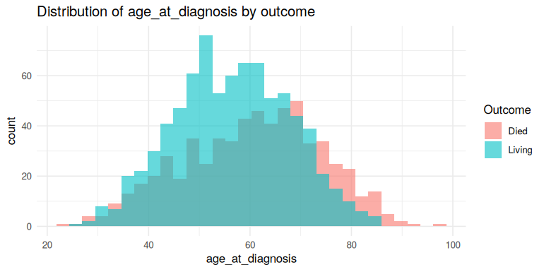<!-- -->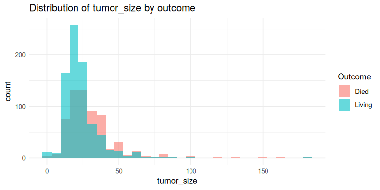<!-- -->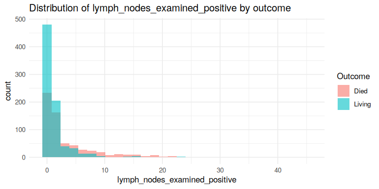<!-- -->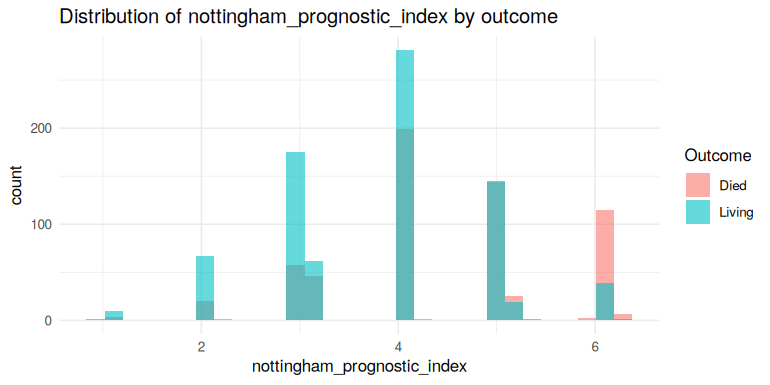<!-- -->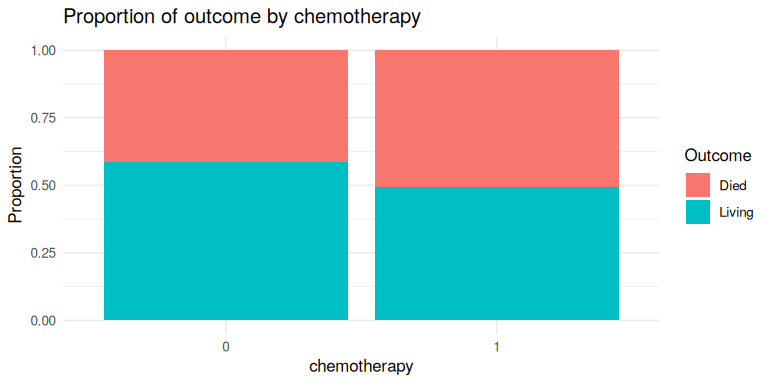<!-- -->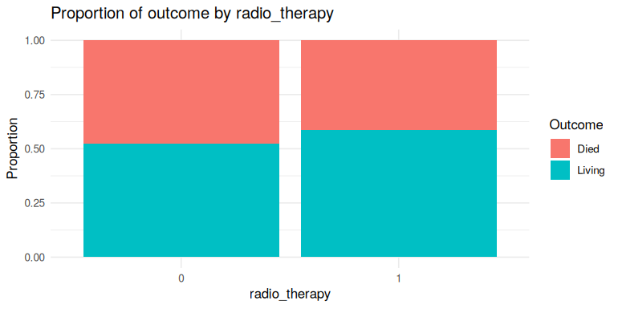<!-- -->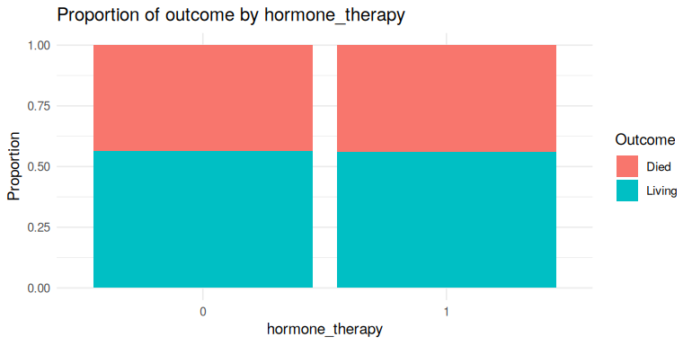<!-- -->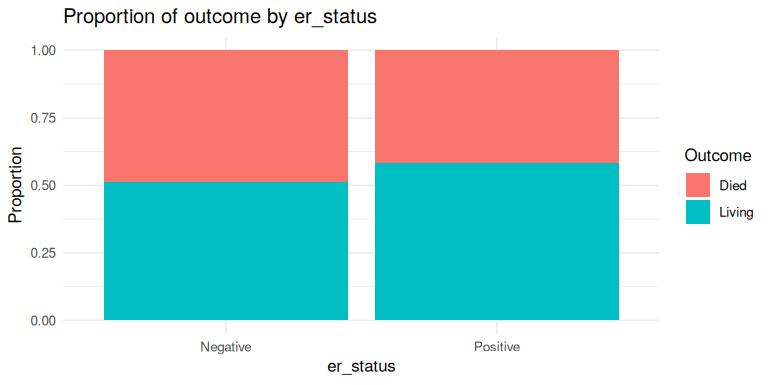<!-- -->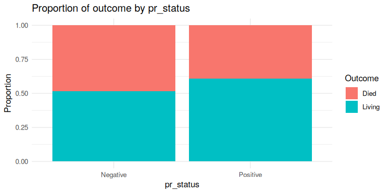<!-- -->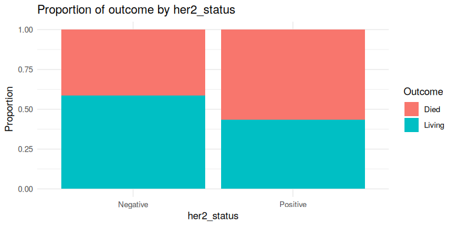<!-- -->

Age at diagnosis shows only a small shift between the two groups. Tumour
size and the number of positive lymph nodes separate the groups more
clearly: large tumours and many positive nodes are more common among
patients who died of the disease. The Nottingham Prognostic Index (NPI),
which combines size, nodes and grade, gives the clearest separation.

Chemotherapy is more common among patients who died, which most likely
reflects that chemotherapy is given to more severe cases (confounding by
indication), not a harmful treatment effect. ER-positive and PR-positive
patients have a lower proportion of cancer deaths, while HER2-positive
patients have a higher one. Overall, disease severity (NPI, size, nodes)
and receptor status look like the most useful clinical predictors.

## 1.8 Train / test split

All preprocessing steps that learn something from the data (imputation
values, correlation filter, scaling) are estimated on the training set
only and then applied to the test set. This keeps the test set
completely unseen.

``` r
train_index <- createDataPartition(df$death_from_cancer, p = 0.8, list = FALSE)
train_raw <- df[train_index, ]
test_raw  <- df[-train_index, ]

rbind(train = table(train_raw$death_from_cancer),
      test  = table(test_raw$death_from_cancer))
```

    ##       Died Living
    ## train  498    641
    ## test   124    160

The split is stratified by the outcome, so both sets have almost the
same proportion of deaths (43.7% in training, 43.7% in test).

## 1.9 Imputation (training statistics only)

``` r
Mode <- function(x) {
  x <- x[!is.na(x)]
  if (length(x) == 0) return(NA)
  ux <- unique(x)
  ux[which.max(tabulate(match(x, ux)))]
}

# Median for numeric columns, mode for factors.
# The fill values are computed on `reference` (the training set).
impute_mixed <- function(data, reference) {
  out <- data
  for (nm in names(out)) {
    if (!anyNA(out[[nm]])) next
    if (is.factor(out[[nm]])) {
      out[[nm]][is.na(out[[nm]])] <- Mode(reference[[nm]])
    } else if (is.numeric(out[[nm]])) {
      out[[nm]][is.na(out[[nm]])] <- median(reference[[nm]], na.rm = TRUE)
    }
  }
  out
}

train_imp <- impute_mixed(train_raw, reference = train_raw)
test_imp  <- impute_mixed(test_raw,  reference = train_raw)

c(train_missing = sum(is.na(train_imp)), test_missing = sum(is.na(test_imp)))
```

    ## train_missing  test_missing 
    ##             0             0

## 1.10 Removing uninformative and redundant features

``` r
# (a) factors with a single level in the training set
single_level <- names(train_imp)[sapply(train_imp, function(x) is.factor(x) && nlevels(droplevels(x)) < 2)]

# (b) very rare mutations: fewer than 10 mutated patients in the training set
mut_in_data <- intersect(mutation_cols, names(train_imp))
rare_mut <- mut_in_data[colSums(train_imp[mut_in_data]) < 10]

single_level
```

    ## character(0)

``` r
length(rare_mut)
```

    ## [1] 53

No factor has a single level in the training data, but 53 of the 173
mutation indicators are mutated in fewer than 10 training patients. Such
columns carry almost no information and make cross-validation folds
unstable, so they are removed.

``` r
train_imp <- train_imp |> select(-all_of(c(single_level, rare_mut)))

num_pred_cols <- setdiff(names(train_imp)[sapply(train_imp, is.numeric)], mutation_cols)
cor_mat <- cor(train_imp[, num_pred_cols])

high_corr <- findCorrelation(cor_mat, cutoff = 0.80, names = TRUE, exact = TRUE)
high_corr
```

    ## [1] "pdgfrb" "akr1c4"

``` r
# Pairs with |r| > 0.80, to see which feature each removed one is related to
high_pairs <- which(abs(cor_mat) > 0.80 & upper.tri(cor_mat), arr.ind = TRUE)
data.frame(var1 = rownames(cor_mat)[high_pairs[, 1]],
           var2 = colnames(cor_mat)[high_pairs[, 2]],
           r    = round(cor_mat[high_pairs], 3))
```

    ##     var1   var2     r
    ## 1 pdgfrb col6a3 0.833
    ## 2 akr1c2 akr1c4 0.879
    ## 3 akr1c3 akr1c4 0.842

Highly correlated predictors make coefficient estimates unstable,
especially in linear models. `findCorrelation()` with a cut-off of 0.80
marks `pdgfrb` and `akr1c4` for removal (the feature of each pair with
the larger mean absolute correlation to the rest). The number of highly
correlated pairs is small because the gene expression values are already
normalised and most genes are only weakly correlated.

``` r
removed_cols <- c(single_level, rare_mut, high_corr)

train_red <- train_raw |> select(-any_of(removed_cols))
train_red <- impute_mixed(train_red, reference = train_raw)
test_red  <- impute_mixed(test_raw |> select(-any_of(removed_cols)), reference = train_raw)

dim(train_red)
```

    ## [1] 1139  633

## 1.11 Scaling (training statistics only)

``` r
scale_cols <- setdiff(names(train_red)[sapply(train_red, is.numeric)], mutation_cols)

scaler <- preProcess(train_red[, scale_cols], method = c("center", "scale"))

train_data <- train_red
test_data  <- test_red
train_data[, scale_cols] <- predict(scaler, train_red[, scale_cols])
test_data[, scale_cols]  <- predict(scaler, test_red[, scale_cols])

# Drop unused factor levels so that train and test dummies match
train_data <- droplevels(train_data)
for (nm in names(test_data)) {
  if (is.factor(test_data[[nm]])) {
    test_data[[nm]] <- factor(test_data[[nm]], levels = levels(train_data[[nm]]))
  }
}
test_data <- impute_mixed(test_data, reference = train_data)  # levels not seen in training -> mode
```

All continuous features are centred and scaled with the mean and
standard deviation of the training set, so that features on different
scales contribute equally (important for penalised regression, KNN and
SVM). Mutation indicators stay 0/1.

## 1.12 PCA

``` r
pca_cols <- setdiff(names(train_data)[sapply(train_data, is.numeric)], mutation_cols)
pca_fit <- prcomp(train_data[, pca_cols], center = FALSE, scale. = FALSE)

var_explained <- pca_fit$sdev^2 / sum(pca_fit$sdev^2)
round(100 * cumsum(var_explained)[c(2, 3, 10, 50)], 1)
```

    ## [1] 14.4 19.9 35.2 57.4

``` r
pca_vis <- data.frame(pca_fit$x[, 1:3], outcome = train_data$death_from_cancer)

ggplot(pca_vis, aes(PC1, PC2, color = outcome)) +
  geom_point(alpha = 0.6) +
  theme_minimal() +
  labs(title = "PCA of training data: PC1 vs PC2", color = "Outcome")
```

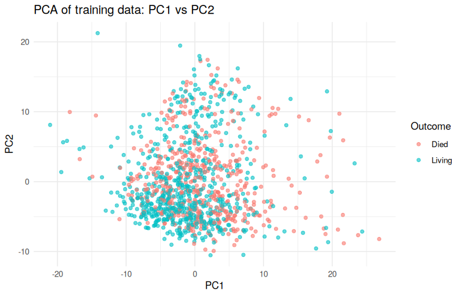<!-- -->

``` r
ggplot(pca_vis, aes(PC1, PC3, color = outcome)) +
  geom_point(alpha = 0.6) +
  theme_minimal() +
  labs(title = "PCA of training data: PC1 vs PC3", color = "Outcome")
```

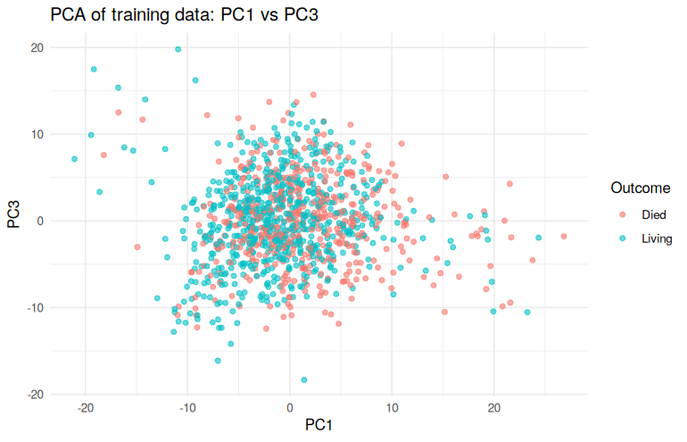<!-- -->

The first two components explain only 14.4% of the variance (the first
three 19.9%), and the two classes overlap strongly in all projections.
The outcome signal is therefore spread over many dimensions or is
non-linear, so a simple 2-D or 3-D linear projection is not enough to
separate the classes. Classification models that use all features are
needed.

## 1.13 Summary of the preprocessing

``` r
data.frame(
  step = c("raw data", "after target filter", "after dropping leakage / high-NA columns",
           "training set (final)", "test set (final)"),
  rows = c(nrow(df_raw), nrow(df_raw |> filter(death_from_cancer %in% c("Living", "Died of Disease"))),
           nrow(df), nrow(train_data), nrow(test_data)),
  columns = c(ncol(df_raw), ncol(df_raw), ncol(df), ncol(train_data), ncol(test_data))
)
```

    ##                                       step rows columns
    ## 1                                 raw data 1904     693
    ## 2                      after target filter 1423     693
    ## 3 after dropping leakage / high-NA columns 1423     688
    ## 4                     training set (final) 1139     633
    ## 5                         test set (final)  284     633

The number of patients drops from 1904 to 1423 only because of the
target definition (Section 1.3); no patient is removed for missing
values. The final modelling data has 632 predictors.

# Part 2. Baseline Models: Lasso and Ridge Logistic Regression

## 2.1 Feature subsets

``` r
all_features <- setdiff(names(train_data), "death_from_cancer")

mutation_features   <- intersect(mutation_cols, all_features)
expression_features <- intersect(expression_cols, all_features)

genetic_features     <- c(expression_features, mutation_features, "mutation_count")
non_genetic_features <- setdiff(all_features, genetic_features)
combined_features    <- all_features

c(non_genetic = length(non_genetic_features),
  genetic     = length(genetic_features),
  combined    = length(combined_features))
```

    ## non_genetic     genetic    combined 
    ##          24         608         632

- **Non-genetic**: clinical, pathological and treatment variables.
- **Genetic**: gene expression, mutation indicators and
  `mutation_count`.
- **Combined**: all features.

## 2.2 Cross-validation set-up and helper functions

``` r
train_control <- trainControl(
  method = "cv", number = 5,
  savePredictions = "final",
  classProbs = TRUE,
  summaryFunction = twoClassSummary
)

f1_score <- function(p, r) {
  if (is.na(p) || is.na(r) || (p + r) == 0) NA_real_ else 2 * p * r / (p + r)
}

# Metrics from a confusion matrix and predicted probabilities
metric_row <- function(pred_class, prob_died, truth, positive = "Died") {
  cm <- confusionMatrix(pred_class, truth, positive = positive)
  roc_obj <- roc(truth, prob_died, levels = c("Living", "Died"), direction = "<", quiet = TRUE)
  precision <- as.numeric(cm$byClass["Pos Pred Value"])
  recall    <- as.numeric(cm$byClass["Sensitivity"])
  tibble(
    Accuracy  = as.numeric(cm$overall["Accuracy"]),
    Precision = precision,
    Recall    = recall,
    F1        = f1_score(precision, recall),
    ROC_AUC   = as.numeric(auc(roc_obj))
  )
}

# Test-set metrics for a caret model
eval_on_test <- function(model, test_sub, positive = "Died") {
  metric_row(
    pred_class = predict(model, newdata = test_sub),
    prob_died  = predict(model, newdata = test_sub, type = "prob")[, positive],
    truth      = test_sub$death_from_cancer
  )
}

# Mean and SD of the metrics over the 5 CV folds (best tuning parameters only)
cv_mean_sd <- function(model, positive = "Died") {
  pred_df <- model$pred
  for (nm in names(model$bestTune)) {
    pred_df <- pred_df[pred_df[[nm]] == model$bestTune[[nm]], ]
  }
  pred_df |>
    group_by(Resample) |>
    group_modify(~ metric_row(.x$pred, .x[[positive]], .x$obs)) |>
    ungroup() |>
    summarise(across(c(Accuracy, Precision, Recall, F1, ROC_AUC),
                     list(mean = ~ mean(.x, na.rm = TRUE), sd = ~ sd(.x, na.rm = TRUE))))
}

# Fit a caret model on one feature subset and evaluate it
fit_caret_model <- function(method, grid, feature_set, algorithm, subset_name, ...) {
  train_sub <- train_data[, c(feature_set, "death_from_cancer")]
  test_sub  <- test_data[,  c(feature_set, "death_from_cancer")]

  set.seed(123)  # same CV folds for every model
  model <- train(
    death_from_cancer ~ .,
    data = train_sub,
    method = method,
    trControl = train_control,
    metric = "ROC",
    tuneGrid = grid,
    ...
  )

  list(
    Algorithm = algorithm,
    Subset    = subset_name,
    model     = model,
    bestTune  = model$bestTune,
    CV        = cv_mean_sd(model),
    Test      = eval_on_test(model, test_sub),
    test_prob = predict(model, newdata = test_sub, type = "prob")[, "Died"]
  )
}

subsets <- list(
  "Non-Genetic" = non_genetic_features,
  "Genetic"     = genetic_features,
  "Combined"    = combined_features
)
```

A 5-fold cross-validation on the training set is used to tune the
hyper-parameters, with ROC-AUC as the selection metric. The seed is
reset before each model so that all models see the same folds. The
held-out test set is used only once per model, for the final evaluation.

## 2.3 Lasso and Ridge on the three subsets

``` r
lambda_grid <- 10^seq(-4, 1, length.out = 60)

glmnet_results <- list()
for (s in names(subsets)) {
  glmnet_results[[paste("Lasso", s)]] <- fit_caret_model(
    "glmnet", expand.grid(alpha = 1, lambda = lambda_grid), subsets[[s]], "Lasso", s)
  glmnet_results[[paste("Ridge", s)]] <- fit_caret_model(
    "glmnet", expand.grid(alpha = 0, lambda = lambda_grid), subsets[[s]], "Ridge", s)
}
```

`alpha = 1` gives the Lasso penalty (some coefficients become exactly
zero) and `alpha = 0` gives the Ridge penalty (all coefficients are
shrunk but kept). The penalty strength `lambda` is searched on a log
scale from 10^-4 to 10, because Ridge usually needs a much larger
`lambda` than Lasso when there are hundreds of predictors.

``` r
pack_row <- function(obj) {
  tibble(Algorithm = obj$Algorithm, Subset = obj$Subset) |>
    bind_cols(obj$CV |> rename_with(~ paste0("CV_", .x))) |>
    bind_cols(obj$Test |> rename_with(~ paste0("Test_", .x)))
}

show_table <- function(tbl) {
  tbl |>
    select(Algorithm, Subset, CV_ROC_AUC_mean, CV_ROC_AUC_sd,
           Test_ROC_AUC, Test_Accuracy, Test_Precision, Test_Recall, Test_F1) |>
    mutate(across(where(is.numeric), ~ round(.x, 3))) |>
    knitr::kable()
}
```

``` r
glmnet_tbl <- bind_rows(lapply(glmnet_results, pack_row)) |> arrange(desc(CV_ROC_AUC_mean))
show_table(glmnet_tbl)
```

| Algorithm | Subset      | CV_ROC_AUC_mean | CV_ROC_AUC_sd | Test_ROC_AUC | Test_Accuracy | Test_Precision | Test_Recall | Test_F1 |
|:----------|:------------|----------------:|--------------:|-------------:|--------------:|---------------:|------------:|--------:|
| Lasso     | Combined    |           0.765 |         0.019 |        0.767 |         0.694 |          0.708 |       0.508 |   0.592 |
| Lasso     | Non-Genetic |           0.758 |         0.037 |        0.760 |         0.690 |          0.676 |       0.556 |   0.611 |
| Ridge     | Non-Genetic |           0.757 |         0.039 |        0.749 |         0.690 |          0.673 |       0.565 |   0.614 |
| Ridge     | Combined    |           0.751 |         0.019 |        0.722 |         0.658 |          0.634 |       0.516 |   0.569 |
| Lasso     | Genetic     |           0.704 |         0.018 |        0.691 |         0.623 |          0.605 |       0.395 |   0.478 |
| Ridge     | Genetic     |           0.699 |         0.011 |        0.682 |         0.609 |          0.573 |       0.411 |   0.479 |

``` r
# Chosen penalty for each model
sapply(glmnet_results, function(x) signif(x$bestTune$lambda, 3))
```

    ## Lasso Non-Genetic Ridge Non-Genetic     Lasso Genetic     Ridge Genetic 
    ##           0.00495           0.01940           0.03490           1.17000 
    ##    Lasso Combined    Ridge Combined 
    ##           0.02870           0.79100

The Lasso model with the combined features has the best mean CV ROC-AUC
(0.765) and also the best test ROC-AUC (0.767). However, the Lasso and
Ridge models on the non-genetic features are very close (CV ROC-AUC
about 0.76), and the difference is smaller than the fold-to-fold
standard deviation. Models that use only the genetic features are
clearly weaker (ROC-AUC about 0.70). So most of the predictive signal
comes from the clinical variables, and gene expression and mutations add
only a small amount on top of them.

Ridge needs a much larger penalty than Lasso on the genetic and combined
subsets (lambda around 1 compared with 0.03), because it has to shrink
hundreds of coefficients at the same time instead of setting most of
them to zero.

With the default 0.5 threshold, recall for the “Died” class is only
about 0.5: the models miss about half of the patients who died.
Precision is higher (about 0.7). If missing high-risk patients is more
costly, the threshold can be lowered to increase recall at the cost of
precision.

## 2.4 Features selected by Lasso (combined subset)

``` r
lasso_comb <- glmnet_results[["Lasso Combined"]]$model
lasso_coef <- as.matrix(coef(lasso_comb$finalModel, s = lasso_comb$bestTune$lambda))
lasso_coef <- lasso_coef[rownames(lasso_coef) != "(Intercept)", 1]

selected <- lasso_coef[lasso_coef != 0]
length(selected)
```

    ## [1] 41

``` r
# Largest coefficients (positive = higher chance of "Living", because caret
# models the second factor level, negative = higher risk of death)
top_coef <- names(sort(abs(selected), decreasing = TRUE))[1:15]
knitr::kable(tibble(feature = top_coef, coefficient = round(selected[top_coef], 3)))
```

| feature                          | coefficient |
|:---------------------------------|------------:|
| gata3_mut                        |       0.328 |
| lymph_nodes_examined_positive    |      -0.320 |
| ncor2_mut                        |       0.264 |
| type_of_breast_surgeryMASTECTOMY |      -0.251 |
| age_at_diagnosis                 |      -0.180 |
| stat5a                           |       0.179 |
| nottingham_prognostic_index      |      -0.166 |
| pam50_claudin_low_subtypeLumA    |       0.150 |
| integrative_cluster5             |      -0.140 |
| cohort3                          |      -0.138 |
| ccnb1                            |      -0.110 |
| tumor_size                       |      -0.101 |
| gsk3b                            |      -0.097 |
| jak2                             |       0.067 |
| mlh1                             |       0.065 |

At the selected penalty the Lasso model keeps 41 of the 664 dummy-coded
predictors, so it gives a much sparser model than Ridge. The largest
effects agree with clinical knowledge: more positive lymph nodes, a
higher NPI, larger tumours, older age and mastectomy (a marker of more
advanced disease) increase the risk of death, while the luminal A
subtype and a *GATA3* mutation, which is typical for luminal,
hormone-sensitive tumours, are linked to better survival. A few gene
expression values (for example *STAT5A*, *CCNB1*, *GSK3B*) are also
kept.

# Part 3. Ensemble and Non-linear Models

All models in this part use the same training set, CV folds and test set
as in Part 2, so their results are directly comparable.

``` r
cl <- makeCluster(max(1, detectCores() - 1))
registerDoParallel(cl)
```

## 3.1 Hyper-parameter grids

``` r
grid_knn <- expand.grid(k = seq(5, 75, by = 10))
grid_svm <- expand.grid(sigma = 2^seq(-11, -5, by = 2), C = 2^seq(-1, 5, by = 2))
tree_depths <- c(2, 3, 4, 5)
rf_depths   <- c(2, 3, 4, 5)
grid_ada <- expand.grid(n.trees = c(50, 100, 200), interaction.depth = c(1, 2, 3),
                        shrinkage = 0.1, n.minobsinnode = 10)
```

- **KNN**: number of neighbours `k`.
- **SVM (RBF kernel)**: kernel width `sigma` and cost `C`. With hundreds
  of scaled features the squared distances between patients are large,
  so small `sigma` values are needed.
- **Decision tree** and **random forest**: maximum depth 2–5.
- **AdaBoost**: implemented with `gbm` using the exponential (AdaBoost)
  loss; the grid covers the number of trees and the depth of each tree.

## 3.2 KNN and SVM

``` r
nonlinear_results <- list()
for (s in names(subsets)) {
  nonlinear_results[[paste("KNN", s)]] <- fit_caret_model("knn", grid_knn, subsets[[s]], "KNN", s)
  nonlinear_results[[paste("SVM", s)]] <- fit_caret_model("svmRadial", grid_svm, subsets[[s]], "SVM (RBF)", s)
}
```

    ## maximum number of iterations reached -2.648747e-05 1.618678e-05maximum number of iterations reached 5.590702e-05 -6.988379e-06maximum number of iterations reached 3.687994e-05 -4.609994e-06maximum number of iterations reached 6.642302e-05 -8.302884e-06maximum number of iterations reached -2.817304e-05 1.721686e-05maximum number of iterations reached 9.260528e-05 -1.157565e-05maximum number of iterations reached -9.041939e-05 1.130241e-05maximum number of iterations reached 0.0001523743 -1.90468e-05maximum number of iterations reached 1.704495e-05 -2.130619e-06maximum number of iterations reached 1.795208e-05 -2.24401e-06maximum number of iterations reached 1.848176e-05 -2.31022e-06maximum number of iterations reached 0.0001571357 -9.602726e-05maximum number of iterations reached 0.0006252121 -7.815101e-05maximum number of iterations reached 0.0004820943 -6.026136e-05maximum number of iterations reached 0.0005711726 -7.139611e-05

## 3.3 Decision tree and random forest (depth tuned by CV)

The maximum depth is not a tuning parameter of caret’s `rpart` and
`ranger` methods, so a small loop fits one model per depth and keeps the
depth with the best mean CV ROC-AUC.

``` r
best_by_depth <- function(depths, fit_one) {
  fits <- lapply(depths, fit_one)
  cv_auc <- sapply(fits, function(x) x$CV$ROC_AUC_mean)
  best <- fits[[which.max(cv_auc)]]
  best$bestTune <- cbind(best$bestTune, max_depth = depths[which.max(cv_auc)])
  best
}

for (s in names(subsets)) {
  nonlinear_results[[paste("Tree", s)]] <- best_by_depth(tree_depths, function(d) {
    fit_caret_model("rpart", data.frame(cp = 0.01), subsets[[s]], "Decision Tree", s,
                    control = rpart.control(maxdepth = d))
  })

  p <- length(subsets[[s]])
  nonlinear_results[[paste("RF", s)]] <- best_by_depth(rf_depths, function(d) {
    fit_caret_model("ranger",
                    expand.grid(mtry = max(1, floor(sqrt(p))), splitrule = "gini", min.node.size = 1),
                    subsets[[s]], "Random Forest", s,
                    num.trees = 500, max.depth = d, num.threads = 1)
  })
}
```

## 3.4 AdaBoost

``` r
for (s in names(subsets)) {
  nonlinear_results[[paste("AdaBoost", s)]] <- fit_caret_model(
    "gbm", grid_ada, subsets[[s]], "AdaBoost", s,
    distribution = "adaboost", verbose = FALSE)
}

stopCluster(cl)
registerDoSEQ()
```

## 3.5 Results

``` r
nonlinear_tbl <- bind_rows(lapply(nonlinear_results, pack_row)) |> arrange(desc(CV_ROC_AUC_mean))
show_table(nonlinear_tbl)
```

| Algorithm     | Subset      | CV_ROC_AUC_mean | CV_ROC_AUC_sd | Test_ROC_AUC | Test_Accuracy | Test_Precision | Test_Recall | Test_F1 |
|:--------------|:------------|----------------:|--------------:|-------------:|--------------:|---------------:|------------:|--------:|
| AdaBoost      | Combined    |           0.760 |         0.021 |        0.759 |         0.673 |          0.653 |       0.532 |   0.587 |
| AdaBoost      | Non-Genetic |           0.756 |         0.040 |        0.762 |         0.704 |          0.696 |       0.573 |   0.628 |
| SVM (RBF)     | Non-Genetic |           0.756 |         0.041 |        0.745 |         0.680 |          0.660 |       0.548 |   0.599 |
| SVM (RBF)     | Combined    |           0.750 |         0.025 |        0.729 |         0.665 |          0.633 |       0.556 |   0.592 |
| KNN           | Non-Genetic |           0.749 |         0.040 |        0.744 |         0.690 |          0.765 |       0.419 |   0.542 |
| Random Forest | Non-Genetic |           0.749 |         0.044 |        0.749 |         0.680 |          0.714 |       0.444 |   0.547 |
| Random Forest | Combined    |           0.746 |         0.015 |        0.743 |         0.673 |          0.696 |       0.444 |   0.542 |
| AdaBoost      | Genetic     |           0.707 |         0.030 |        0.678 |         0.613 |          0.569 |       0.468 |   0.513 |
| Decision Tree | Non-Genetic |           0.695 |         0.030 |        0.670 |         0.655 |          0.625 |       0.524 |   0.570 |
| KNN           | Combined    |           0.695 |         0.023 |        0.711 |         0.658 |          0.714 |       0.363 |   0.481 |
| SVM (RBF)     | Genetic     |           0.691 |         0.013 |        0.685 |         0.620 |          0.570 |       0.524 |   0.546 |
| Random Forest | Genetic     |           0.690 |         0.019 |        0.703 |         0.641 |          0.637 |       0.411 |   0.500 |
| KNN           | Genetic     |           0.669 |         0.025 |        0.701 |         0.637 |          0.657 |       0.355 |   0.461 |
| Decision Tree | Combined    |           0.640 |         0.038 |        0.679 |         0.658 |          0.631 |       0.524 |   0.573 |
| Decision Tree | Genetic     |           0.606 |         0.023 |        0.585 |         0.613 |          0.574 |       0.435 |   0.495 |

``` r
for (nm in names(nonlinear_results)) {
  bt <- nonlinear_results[[nm]]$bestTune
  cat(sprintf("%-26s %s\n", nm, paste(names(bt), sapply(bt, as.character), sep = " = ", collapse = ", ")))
}
```

    ## KNN Non-Genetic            k = 75
    ## SVM Non-Genetic            sigma = 0.00048828125, C = 32
    ## KNN Genetic                k = 45
    ## SVM Genetic                sigma = 0.00048828125, C = 0.5
    ## KNN Combined               k = 45
    ## SVM Combined               sigma = 0.001953125, C = 2
    ## Tree Non-Genetic           cp = 0.01, max_depth = 5
    ## RF Non-Genetic             mtry = 4, splitrule = gini, min.node.size = 1, max_depth = 5
    ## Tree Genetic               cp = 0.01, max_depth = 4
    ## RF Genetic                 mtry = 24, splitrule = gini, min.node.size = 1, max_depth = 5
    ## Tree Combined              cp = 0.01, max_depth = 3
    ## RF Combined                mtry = 25, splitrule = gini, min.node.size = 1, max_depth = 5
    ## AdaBoost Non-Genetic       n.trees = 50, interaction.depth = 3, shrinkage = 0.1, n.minobsinnode = 10
    ## AdaBoost Genetic           n.trees = 200, interaction.depth = 1, shrinkage = 0.1, n.minobsinnode = 10
    ## AdaBoost Combined          n.trees = 200, interaction.depth = 1, shrinkage = 0.1, n.minobsinnode = 10

AdaBoost with the combined features has the best mean CV ROC-AUC in this
part (0.76), followed by SVM, KNN and random forest on the non-genetic
features, all around 0.75. A single decision tree is clearly the weakest
model (about 0.70), which is expected because one shallow tree has high
variance and captures only a few splits.

For KNN, SVM, random forest and the decision tree, the non-genetic
subset is as good as or better than the combined one. These methods do
not select features: KNN and SVM use distances over all features, so
hundreds of noisy gene expression values dilute the useful clinical
signal. Boosting, like Lasso, can focus on a few informative features,
which is why it is the only non-linear method that gains from the
combined subset.

For KNN (k = 75 on the non-genetic subset) and SVM (C = 32) the chosen
values are at the edge of the grid. A wider grid might improve these two
models a little, but their CV ROC-AUC is already on a flat plateau, so
large gains are unlikely.

# Part 4. Model Comparison and Interpretation with SHAP

## 4.1 Overall comparison

``` r
all_results <- c(glmnet_results, nonlinear_results)
all_tbl <- bind_rows(lapply(all_results, pack_row))

# Best subset for each algorithm (by mean CV ROC-AUC)
best_per_algorithm <- all_tbl |>
  group_by(Algorithm) |>
  slice_max(CV_ROC_AUC_mean, n = 1, with_ties = FALSE) |>
  ungroup() |>
  arrange(desc(CV_ROC_AUC_mean))

show_table(best_per_algorithm)
```

| Algorithm     | Subset      | CV_ROC_AUC_mean | CV_ROC_AUC_sd | Test_ROC_AUC | Test_Accuracy | Test_Precision | Test_Recall | Test_F1 |
|:--------------|:------------|----------------:|--------------:|-------------:|--------------:|---------------:|------------:|--------:|
| Lasso         | Combined    |           0.765 |         0.019 |        0.767 |         0.694 |          0.708 |       0.508 |   0.592 |
| AdaBoost      | Combined    |           0.760 |         0.021 |        0.759 |         0.673 |          0.653 |       0.532 |   0.587 |
| Ridge         | Non-Genetic |           0.757 |         0.039 |        0.749 |         0.690 |          0.673 |       0.565 |   0.614 |
| SVM (RBF)     | Non-Genetic |           0.756 |         0.041 |        0.745 |         0.680 |          0.660 |       0.548 |   0.599 |
| KNN           | Non-Genetic |           0.749 |         0.040 |        0.744 |         0.690 |          0.765 |       0.419 |   0.542 |
| Random Forest | Non-Genetic |           0.749 |         0.044 |        0.749 |         0.680 |          0.714 |       0.444 |   0.547 |
| Decision Tree | Non-Genetic |           0.695 |         0.030 |        0.670 |         0.655 |          0.625 |       0.524 |   0.570 |

``` r
dir.create(file.path("..", "results"), showWarnings = FALSE)
write_csv(all_tbl |> arrange(desc(CV_ROC_AUC_mean)),
          file.path("..", "results", "model_comparison.csv"))
```

``` r
ggplot(best_per_algorithm,
       aes(x = reorder(Algorithm, CV_ROC_AUC_mean), y = CV_ROC_AUC_mean)) +
  geom_pointrange(aes(ymin = CV_ROC_AUC_mean - CV_ROC_AUC_sd,
                      ymax = CV_ROC_AUC_mean + CV_ROC_AUC_sd)) +
  geom_point(aes(y = Test_ROC_AUC), shape = 4, size = 3, colour = "firebrick") +
  coord_flip() +
  theme_minimal() +
  labs(x = NULL, y = "ROC-AUC",
       title = "Best subset per algorithm",
       subtitle = "dot and bar: CV mean +/- SD, cross: test set")
```

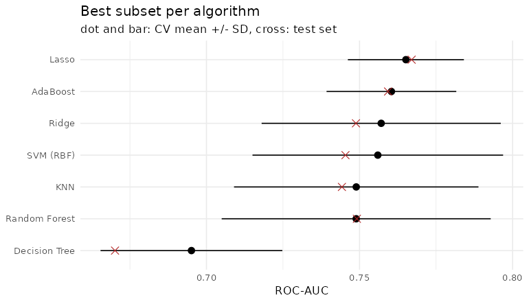<!-- -->

``` r
roc_curves <- lapply(seq_len(nrow(best_per_algorithm)), function(i) {
  key <- paste(best_per_algorithm$Algorithm[i], best_per_algorithm$Subset[i])
  res <- all_results[[names(all_results)[sapply(all_results, function(r)
    paste(r$Algorithm, r$Subset) == key)]]]
  r <- roc(test_data$death_from_cancer, res$test_prob,
           levels = c("Living", "Died"), direction = "<", quiet = TRUE)
  tibble(fpr = 1 - r$specificities, tpr = r$sensitivities,
         model = sprintf("%s (%s), AUC = %.3f", res$Algorithm, res$Subset, auc(r)))
})

ggplot(bind_rows(roc_curves), aes(fpr, tpr, colour = model)) +
  geom_path() +
  geom_abline(linetype = "dashed", colour = "grey60") +
  theme_minimal() +
  theme(legend.position = "bottom", legend.direction = "vertical") +
  labs(x = "False positive rate", y = "True positive rate", colour = NULL,
       title = "ROC curves on the test set")
```

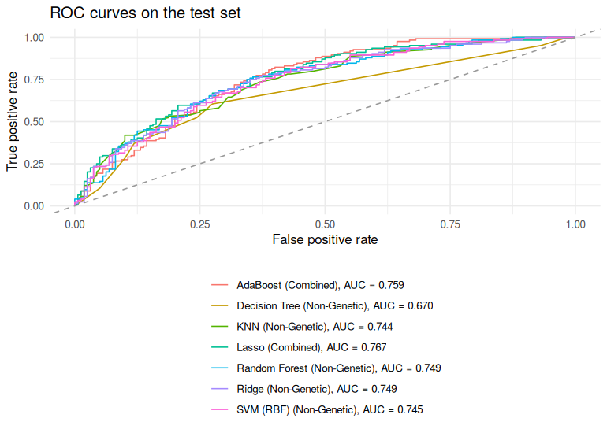<!-- -->

``` r
overall_best <- best_per_algorithm |> slice(1)
overall_best
```

    ## # A tibble: 1 x 17
    ##   Algorithm Subset   CV_Accuracy_mean CV_Accuracy_sd CV_Precision_mean
    ##   <chr>     <chr>               <dbl>          <dbl>             <dbl>
    ## 1 Lasso     Combined            0.705         0.0226             0.710
    ## # i 12 more variables: CV_Precision_sd <dbl>, CV_Recall_mean <dbl>,
    ## #   CV_Recall_sd <dbl>, CV_F1_mean <dbl>, CV_F1_sd <dbl>,
    ## #   CV_ROC_AUC_mean <dbl>, CV_ROC_AUC_sd <dbl>, Test_Accuracy <dbl>,
    ## #   Test_Precision <dbl>, Test_Recall <dbl>, Test_F1 <dbl>, Test_ROC_AUC <dbl>

``` r
best_key <- names(all_results)[sapply(all_results, function(r)
  r$Algorithm == overall_best$Algorithm && r$Subset == overall_best$Subset)]
best_result <- all_results[[best_key]]
best_features <- subsets[[overall_best$Subset]]
```

The best model overall is **Lasso** on the **Combined** features, with a
mean CV ROC-AUC of 0.765 (SD 0.019) and a test ROC-AUC of 0.767. For
most models the test ROC-AUC is within a few hundredths of the CV
estimate, so there is no sign of overfitting to the CV folds.

The differences between the top six algorithms (CV ROC-AUC 0.749–0.765)
are smaller than one standard deviation across folds, so they perform
practically the same. In this situation the simpler and more
interpretable model is preferred, which is another reason to choose the
Lasso logistic regression: it uses only 41 predictors and its
coefficients can be read directly. The ROC curves also show that no
model dominates the others over the whole range of thresholds.

Note: an earlier version of this analysis reached a ROC-AUC of about
0.88, but it included `overall_survival_months` as a predictor. That
variable is known only at the end of follow-up and is strongly tied to
the outcome, so the earlier result was over-optimistic. The values
reported here (about 0.77) are a fair estimate of what the models can do
with information available at diagnosis.

## 4.2 SHAP values for the best model

SHAP values split one prediction into additive contributions of the
features: for each patient, the SHAP values of all features add up to
the difference between the predicted probability of death and the
average prediction. They are estimated here with the permutation
sampling method (Štrumbelj & Kononenko, 2014), which works for any
model: features are switched one at a time, in random order, from a
background patient to the patient being explained, and the change in the
predicted probability is recorded. Averaging over many random orders
gives the SHAP value. The explanation is computed for the test patients,
with the training set as background.

``` r
permutation_shap <- function(model, X_explain, X_background, nsim = 20, positive = "Died") {
  n <- nrow(X_explain)
  p <- ncol(X_explain)
  phi <- matrix(0, n, p, dimnames = list(NULL, names(X_explain)))
  pred_fun <- function(X) predict(model, newdata = X, type = "prob")[, positive]

  for (s in seq_len(nsim)) {
    order_s <- sample(p)                                      # random feature order
    current <- X_background[sample(nrow(X_background), n, replace = TRUE), ]
    prev <- pred_fun(current)
    for (j in order_s) {
      current[[j]] <- X_explain[[j]]                          # switch feature j to the real value
      new <- pred_fun(current)
      phi[, j] <- phi[, j] + (new - prev)                     # marginal contribution of feature j
      prev <- new
    }
  }
  phi / nsim
}
```

``` r
X_train_shap <- as.data.frame(train_data[, best_features])
X_test_shap  <- as.data.frame(test_data[,  best_features])

set.seed(123)
shap_time <- system.time(
  shap_values <- permutation_shap(best_result$model, X_test_shap, X_train_shap, nsim = 20)
)
shap_time[["elapsed"]]
```

    ## [1] 621.659

``` r
# Check: SHAP values add up to prediction minus average prediction
pred_test <- predict(best_result$model, X_test_shap, type = "prob")[, "Died"]
base_value <- mean(predict(best_result$model, X_train_shap, type = "prob")[, "Died"])
summary(rowSums(shap_values) - (pred_test - base_value))
```

    ##      Min.   1st Qu.    Median      Mean   3rd Qu.      Max. 
    ## -0.141524 -0.029942 -0.005769 -0.004403  0.019169  0.110440

The last output checks the additivity property: for each patient the sum
of the SHAP values should equal the predicted probability minus the
average prediction (0.437). The differences are centred at zero (mean
-0.004); they are not exactly zero because each patient is compared with
only 20 randomly drawn background patients. More simulations reduce this
error but increase the run time (about 10 minutes here).

## 4.3 Global feature importance

``` r
shap_importance <- sort(colMeans(abs(shap_values)), decreasing = TRUE)
top_features <- names(shap_importance)[1:15]

tibble(feature = factor(top_features, levels = rev(top_features)),
       mean_abs_shap = shap_importance[top_features]) |>
  ggplot(aes(feature, mean_abs_shap)) +
  geom_col(fill = "steelblue") +
  coord_flip() +
  theme_minimal() +
  labs(x = NULL, y = "mean |SHAP| (change in P(Died))",
       title = paste("SHAP feature importance:", overall_best$Algorithm, "-", overall_best$Subset))
```

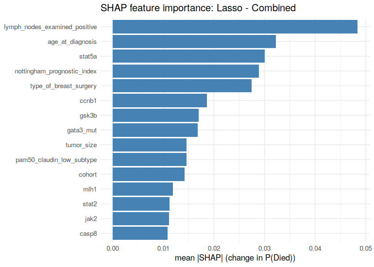<!-- -->

``` r
# Colour = feature value scaled to 0-1 within each feature (factors use level order)
feature_value_01 <- function(x) {
  x <- as.numeric(x)
  if (max(x) == min(x)) return(rep(0.5, length(x)))
  (x - min(x)) / (max(x) - min(x))
}

shap_long <- bind_rows(lapply(top_features, function(f) {
  tibble(feature = f, shap = shap_values[, f], value = feature_value_01(X_test_shap[[f]]))
})) |>
  mutate(feature = factor(feature, levels = rev(top_features)))

ggplot(shap_long, aes(shap, feature, colour = value)) +
  geom_vline(xintercept = 0, colour = "grey70") +
  geom_jitter(height = 0.2, width = 0, size = 1.2, alpha = 0.8) +
  scale_colour_gradient(low = "#2c7bb6", high = "#d7191c", breaks = c(0, 1),
                        labels = c("low", "high")) +
  theme_minimal() +
  labs(x = "SHAP value (effect on P(Died))", y = NULL, colour = "Feature value",
       title = "SHAP summary plot (test set)")
```

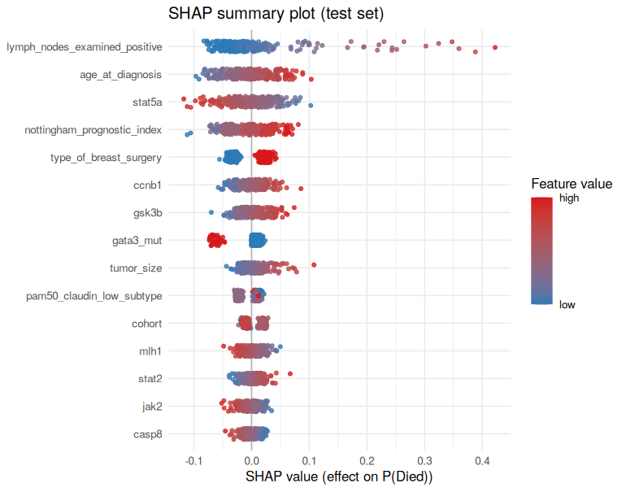<!-- -->

## 4.4 Dependence plot for the most important feature

``` r
top_numeric <- top_features[sapply(X_test_shap[top_features], is.numeric)][1]

tibble(value = X_test_shap[[top_numeric]], shap = shap_values[, top_numeric]) |>
  ggplot(aes(value, shap)) +
  geom_point(alpha = 0.6) +
  geom_smooth(method = "loess", se = FALSE, colour = "firebrick") +
  theme_minimal() +
  labs(x = paste(top_numeric, "(standardised)"), y = "SHAP value",
       title = paste("SHAP dependence plot:", top_numeric))
```

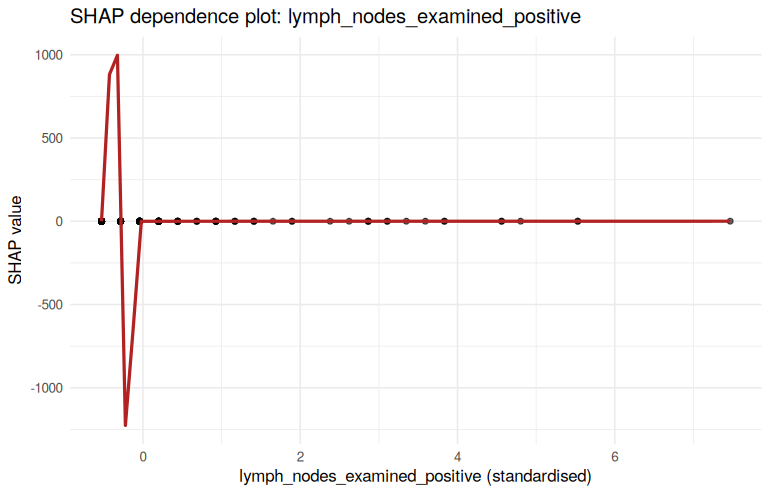<!-- -->

## 4.5 Top 10 contributing features

``` r
tibble(rank = 1:10,
       feature = names(shap_importance)[1:10],
       mean_abs_shap = round(shap_importance[1:10], 4)) |>
  knitr::kable()
```

| rank | feature                       | mean_abs_shap |
|-----:|:------------------------------|--------------:|
|    1 | lymph_nodes_examined_positive |        0.0484 |
|    2 | age_at_diagnosis              |        0.0322 |
|    3 | stat5a                        |        0.0300 |
|    4 | nottingham_prognostic_index   |        0.0289 |
|    5 | type_of_breast_surgery        |        0.0275 |
|    6 | ccnb1                         |        0.0186 |
|    7 | gsk3b                         |        0.0170 |
|    8 | gata3_mut                     |        0.0167 |
|    9 | tumor_size                    |        0.0146 |
|   10 | pam50_claudin_low_subtype     |        0.0145 |

The SHAP analysis agrees with the Lasso coefficients and with the
exploratory plots:

- **Number of positive lymph nodes** is the most important feature. Most
  patients have few positive nodes and small negative SHAP values, but
  patients with many positive nodes get a large increase in the
  predicted probability of death (up to about +0.4).
- **Age at diagnosis**, **Nottingham Prognostic Index** and **tumour
  size**: higher values increase the predicted risk.
- **Type of surgery**: mastectomy increases the predicted risk compared
  with breast-conserving surgery. This is not a causal effect of the
  surgery; it reflects that mastectomy is chosen for larger or more
  advanced tumours.
- **Gene expression**: high *STAT5A* expression lowers the predicted
  risk, while high *CCNB1* (a cell-cycle / proliferation gene) and
  *GSK3B* expression raise it.
- **GATA3 mutation** and the **PAM50 subtype** (luminal A) are linked to
  a lower risk.

The clinical features dominate the ranking, and the genetic features act
as smaller corrections. This matches the results of Parts 2 and 3, where
the genetic-only models were the weakest and adding genetic features to
the clinical ones gave only a small improvement.

# Conclusion

- After removing leakage variables (`overall_survival`,
  `overall_survival_months`) and the patient identifier, the best models
  reach a ROC-AUC of about 0.76–0.77 for predicting
  breast-cancer–specific death.
- Clinical variables (lymph nodes, NPI, tumour size, age, receptor
  status and subtype) carry most of the predictive information. Gene
  expression and mutation data alone give ROC-AUC of about 0.70 and add
  only a small gain when combined with the clinical data.
- The penalised Lasso logistic regression on the combined features
  performs as well as the more complex non-linear models (AdaBoost, SVM,
  random forest) while being sparse and easy to interpret, so it is
  chosen as the final model.
- With the default threshold, recall for the “Died” class is about 0.5.
  In a clinical setting the threshold should be chosen based on the
  relative cost of missed high-risk patients and false alarms.
- Possible extensions: time-to-event models (Cox regression, random
  survival forests) that use the survival time as the outcome instead of
  discarding it, repeated CV for more stable comparisons, and threshold
  tuning.

``` r
sessionInfo()
```

    ## R version 4.3.3 (2024-02-29)
    ## Platform: x86_64-pc-linux-gnu (64-bit)
    ## Running under: Ubuntu 24.04.4 LTS
    ## 
    ## Matrix products: default
    ## BLAS:   /usr/lib/x86_64-linux-gnu/blas/libblas.so.3.12.0 
    ## LAPACK: /usr/lib/x86_64-linux-gnu/lapack/liblapack.so.3.12.0
    ## 
    ## locale:
    ## [1] C
    ## 
    ## time zone: Asia/Tehran
    ## tzcode source: system (glibc)
    ## 
    ## attached base packages:
    ## [1] parallel  stats     graphics  grDevices utils     datasets  methods  
    ## [8] base     
    ## 
    ## other attached packages:
    ##  [1] doParallel_1.0.17 iterators_1.0.14  foreach_1.5.2     gbm_2.1.8.1      
    ##  [5] ranger_0.16.0     rpart_4.1.23      kernlab_0.9-32    pROC_1.18.5      
    ##  [9] glmnet_4.1-8      Matrix_1.6-5      caret_6.0-94      lattice_0.22-5   
    ## [13] ggplot2_3.4.4     tidyr_1.3.1       dplyr_1.1.4       readr_2.1.5      
    ## 
    ## loaded via a namespace (and not attached):
    ##  [1] tidyselect_1.2.0     timeDate_4032.109    farver_2.1.1        
    ##  [4] fastmap_1.1.1        digest_0.6.34        timechange_0.3.0    
    ##  [7] lifecycle_1.0.4      survival_3.5-8       magrittr_2.0.3      
    ## [10] compiler_4.3.3       rlang_1.1.3          tools_4.3.3         
    ## [13] utf8_1.2.4           yaml_2.3.8           data.table_1.14.10  
    ## [16] knitr_1.45           labeling_0.4.3       bit_4.0.5           
    ## [19] plyr_1.8.9           withr_2.5.0          purrr_1.0.2         
    ## [22] nnet_7.3-19          grid_4.3.3           stats4_4.3.3        
    ## [25] fansi_1.0.5          e1071_1.7-14         colorspace_2.1-0    
    ## [28] future_1.33.1        globals_0.16.2       scales_1.3.0        
    ## [31] MASS_7.3-60.0.1      cli_3.6.2            rmarkdown_2.25      
    ## [34] crayon_1.5.2         generics_0.1.3       future.apply_1.11.1 
    ## [37] reshape2_1.4.4       tzdb_0.4.0           proxy_0.4-27        
    ## [40] stringr_1.5.1        splines_4.3.3        vctrs_0.6.5         
    ## [43] hardhat_1.3.1        hms_1.1.3            bit64_4.0.5         
    ## [46] listenv_0.9.1        gower_1.0.1          recipes_1.0.9       
    ## [49] glue_1.7.0           parallelly_1.37.1    codetools_0.2-19    
    ## [52] lubridate_1.9.3      stringi_1.8.3        gtable_0.3.4        
    ## [55] shape_1.4.6          munsell_0.5.0        tibble_3.2.1        
    ## [58] pillar_1.9.0         htmltools_0.5.7      ipred_0.9-14        
    ## [61] lava_1.7.3           R6_2.5.1             vroom_1.6.5         
    ## [64] evaluate_0.23        highr_0.10           class_7.3-22        
    ## [67] Rcpp_1.0.12          nlme_3.1-164         prodlim_2023.08.28  
    ## [70] mgcv_1.9-1           xfun_0.41            ModelMetrics_1.2.2.2
    ## [73] pkgconfig_2.0.3
